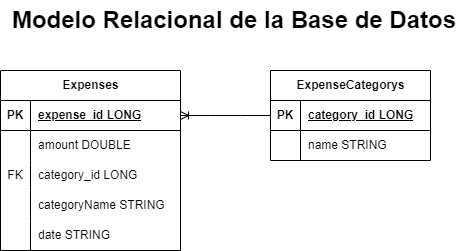
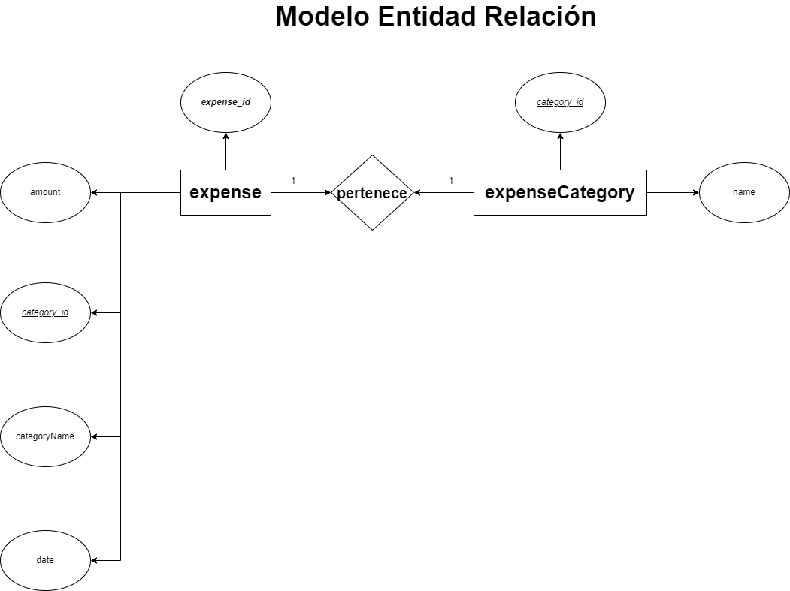

📌 Este proyecto es una aplicación Java Spring Boot diseñada para administrar gastos (expenses) junto con sus categorías asociadas.
La arquitectura de la aplicación sigue un enfoque de tres capas, que abarca los controladores, los servicios y los repositorios. 
Este último hace uso del patrón JDBC template para facilitar el acceso a la base de datos y la manipulación de los datos relacionados con los gastos y categorías.

-----------------------------------------------------------------------------------------------------------------------------------------------------

### Listado de Entidades
- **expenses** (ED)
    - expense_id **(PK)**
    - amount
    - category_id **(FK)**
    - categoryName
    - date

- **expenseCategory (EC)**
    - category_id **(PK)**
    - name

### Relaciones
1. Un **expense** _pertenece_ a una **expenseCategory** (1 a 1).

### Diagramas

### Modelo Entidad - Relacion

### Modelo Relacional de la BD

### ENDPOINTS

📍 GET | /api/v1/expense/{id}
   - Obtiene un gasto por ID

📍 GET | /api/v1/expense
   - Obtiene todos los gastos

📍 GET | /api/v1/expense/sum-by-month
   - Obtiene la suma de gastos de un mes y un año especifico

📍 GET | /api/v1/expense/total-sum
   - Obtiene la suma total de gastos

📍 GET | /api/v1/expense/categories
   - Obtiene todas las categorías de gastos
     
📍 GET | /api/v1/expense/{name}
   - Obtiene los gastos por categoría

📍 POST | /api/v1/expense
   - Crea un nuevo gasto

📍 PUT | /api/v1/expense/update
   - Actualiza un gasto existente

📍 DELETE | /api/v1/expense/{id}
   - Elimina un gasto existente

